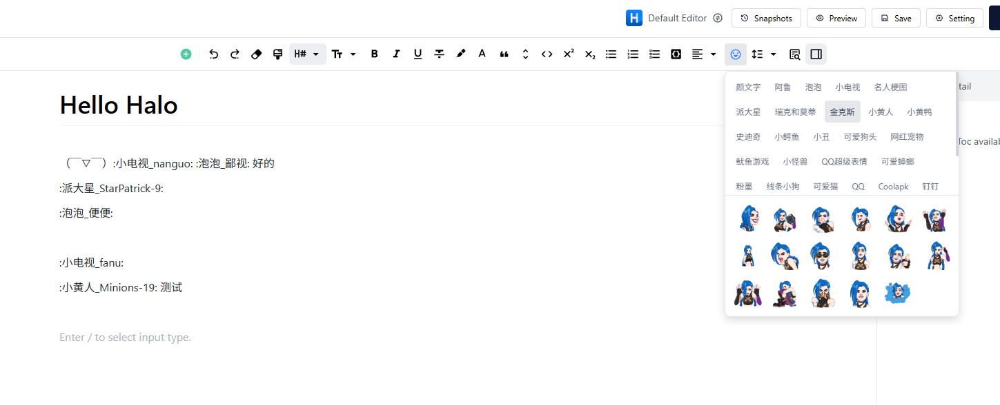
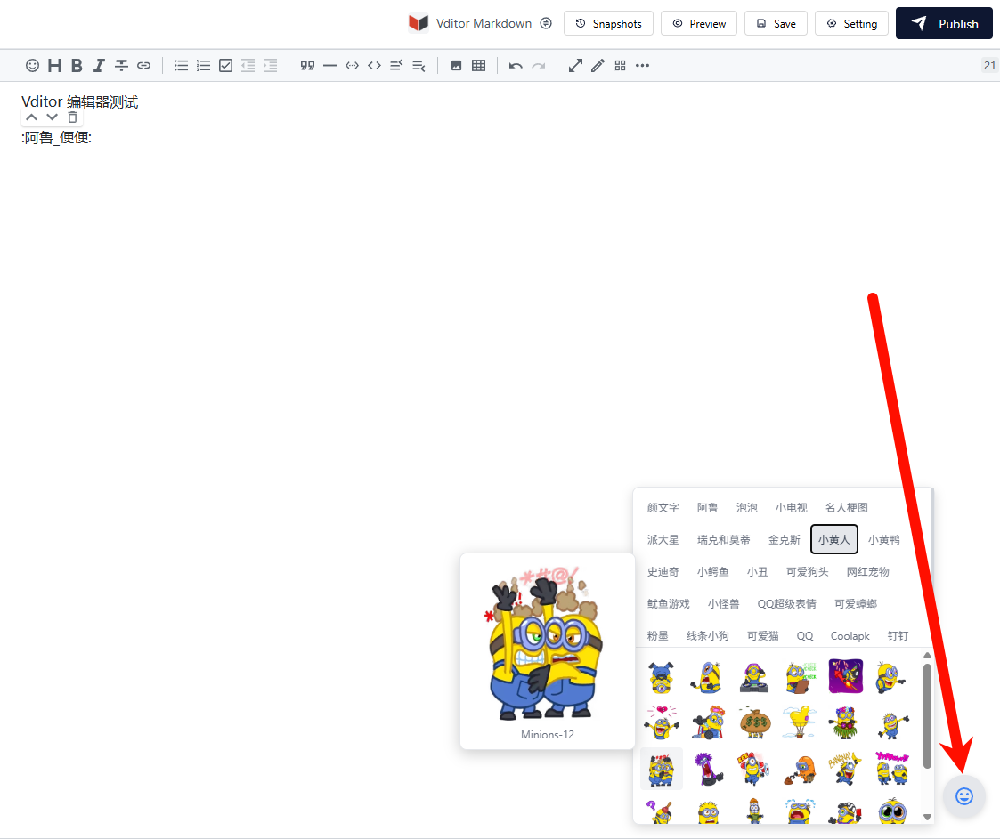
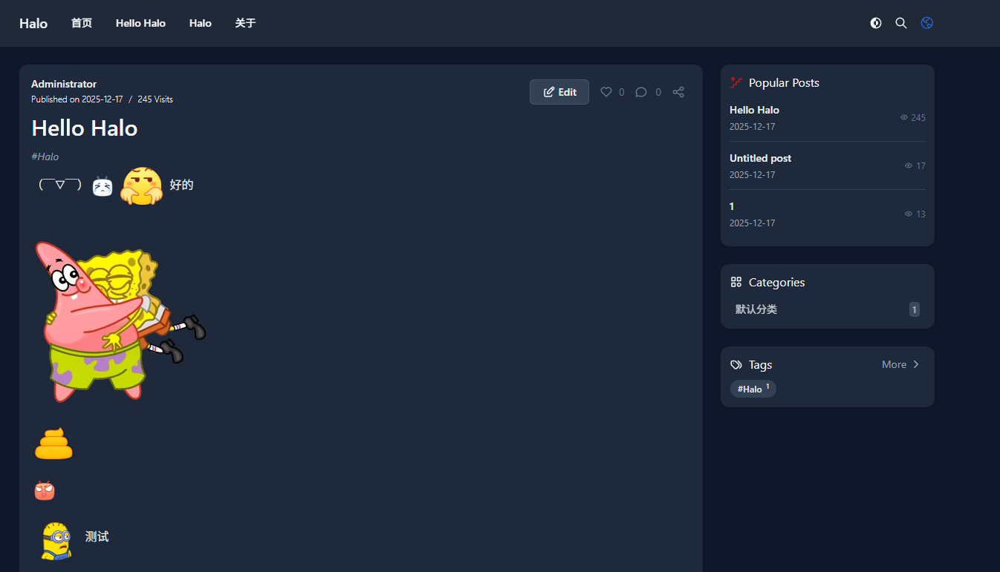
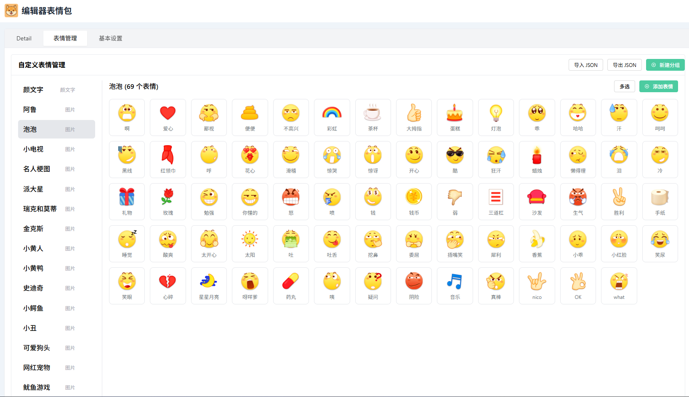

# Editor Sticker - Halo 编辑器表情包插件

为 Halo 编辑器添加 OwO 表情包面板，让你的文章更加生动有趣！

## ✨ 功能特性

- 🎨 支持多种编辑器：默认编辑器、Vditor、ByteMD、Willow MDE
- 📦 内置丰富表情包，开箱即用
- 🛠️ 自定义表情管理：支持添加分组、上传表情、批量删除
- 📥 导入/导出：支持 JSON 格式导入导出自定义表情
- 🎯 智能显示：表情与文字并排时小尺寸，独占一行时自动放大
- 🔧 灵活配置：可自定义表情尺寸、样式
- 🚫 转义支持：使用 `\:xxx\:` 显示原始短代码文本

## 📸 截图预览





> 默认编辑器的表情包按钮在工具栏，其余编辑器在右下角（DOM 注入）。

## 📦 安装

1. 下载最新的 [Release](https://github.com/SwaggyMacro/plugin-editor-sticker/releases) 版本
2. 在 Halo 后台 -> 插件 -> 安装，上传 jar 文件
3. 启用插件

## ⚙️ 配置说明

在插件设置中可以配置：

| 配置项 | 说明 | 默认值 |
|--------|------|--------|
| 启用自定义模式 | 使用自定义表情管理，忽略配置 URL | 关闭 |
| 表情包配置 URL | OwO 格式的 JSON 配置地址 | 内置默认表情 |
| 内联最大宽度 | 表情与文字并排时的最大宽度 | 64px |
| 内联最大高度 | 表情与文字并排时的最大高度 | 64px |
| 独占行最大宽度 | 表情独占一行时的最大宽度 | 256px |
| 独占行最大高度 | 表情独占一行时的最大高度 | 256px |
| 额外样式 | 自定义 CSS 样式 | 空 |

> 修改配置（URL/自定义模式）后需要保存并刷新页面前台才能生效。

## 🎯 使用方法

### 编辑器中使用

1. 在支持的编辑器中，点击工具栏的表情按钮 😀。默认编辑器以外的编辑器，表情按钮位于右下角。
2. 选择表情分组，点击表情即可插入
3. 表情会以 `:shortcode:` 格式插入，发布后自动渲染为图片

### 自定义表情管理

1. 在插件设置中启用「自定义模式」
2. 切换到「表情管理」标签页
3. 可以：
   - 添加分组：创建新的表情分组
   - 添加表情：选择图片并设置短代码
   - 编辑/删除：管理已有表情
   - 批量删除：多选后批量删除
   - 导入/导出：JSON 格式备份和恢复

### 转义短代码

如果想显示原始的短代码文本而不是表情图片，使用反斜杠转义：

```
\:alu_你好:\ 会显示为文本 :alu_你好:
```

## 🔧 开发

### 环境要求

- Java 21+
- Node.js 18+
- pnpm

### 本地开发

```bash
# 启动 Halo 开发服务器
./gradlew haloServer

# 前端开发（另开终端）
cd ui
pnpm install
pnpm dev
```

### 构建

```bash
./gradlew build
```

构建产物位于 `build/libs` 目录。

## 📝 表情配置格式

支持标准 OwO JSON 格式：

```json
{
  "分组名称": {
    "type": "image",
    "container": [
      {
        "text": "shortcode",
        "icon": ""
      }
    ]
  }
}
```
> origin 字段可选，用于指定原始图片地址。  
> 当 origin 字段存在时，渲染时使用 origin 地址，src 用于预览。  
> (用于当原图文件过大时，可以使用压缩图预览)

## 🤝 贡献

欢迎提交 Issue 和 Pull Request！

## 📄 许可证

[GPL-3.0](./LICENSE) © SwaggyMacro
